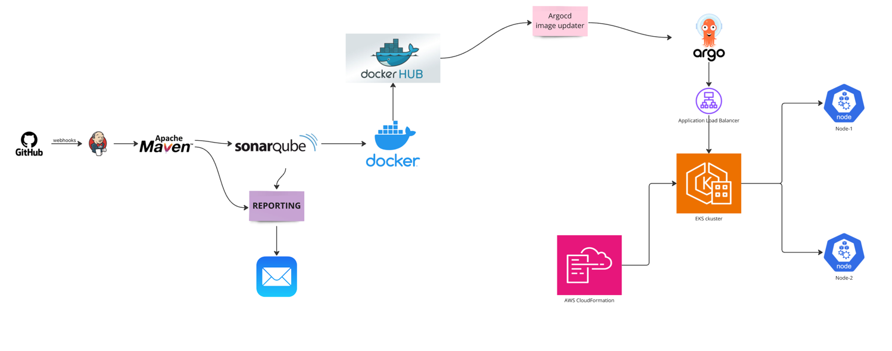
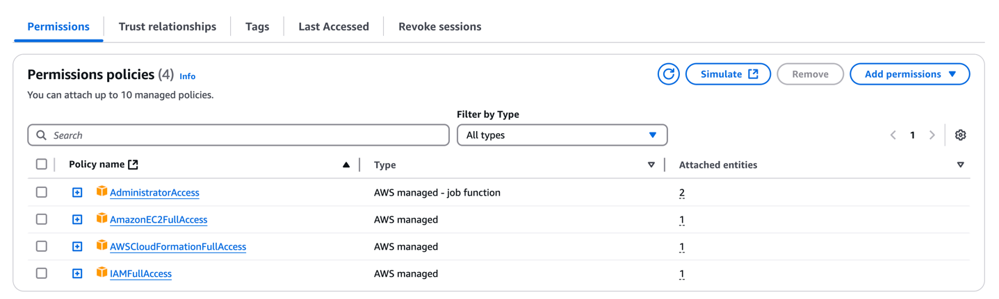
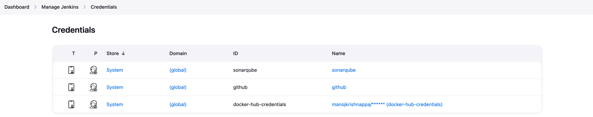

# complete-cicd-project-microdegree

# CI-CD
This is Simple ci-cd project

# Architecture for application

# Create a EC2 instance via terraform or we can do manually also  

```yaml
provider "aws" {
    region = "us-east-1"
    access_key = "xxx"
    secret_key = "xx"
}

resource "aws_instance" "admin" {
    ami = "ami-04b4f1a9cf54c11d0"
    instance_type = "t2.medium"
    security_groups = [ "default" ]
    key_name = "project"
    root_block_device {
      volume_size = 30
      volume_type = "gp2"
      delete_on_termination = true
    }
    tags = {
      Name = "Admin-server"
    }

}

output "PublicIP" {
    value =  aws_instance.admin.public_ip
}
```
### terraform commands:
```commandline
terraform init
```
```commandline
terraform plan
```
```commandline
terraform apply
```
```commandline
terraform destroy
```

## Installing the jenkins:
ref: https://www.jenkins.io/doc/book/installing/linux/#debianubuntu
```yaml
#!/bin/bash
sudo apt update
sudo apt install fontconfig openjdk-17-jre -y
sudo wget -O /usr/share/keyrings/jenkins-keyring.asc \
  https://pkg.jenkins.io/debian-stable/jenkins.io-2023.key
echo "deb [signed-by=/usr/share/keyrings/jenkins-keyring.asc]" \
  https://pkg.jenkins.io/debian-stable binary/ | sudo tee \
  /etc/apt/sources.list.d/jenkins.list > /dev/null
sudo apt-get update
sudo apt-get install jenkins -y
```
```
sh jenkins.sh
```

## To verify the jenkins status

```commandline
systemctl enable jenkins
systemctl start jenkins
systemctl status jenkins
```

# Setup Kubernetes on Amazon EKS

You can follow same procedure in the official  AWS document [Getting started with Amazon EKS – eksctl](https://docs.aws.amazon.com/eks/latest/userguide/getting-started-eksctl.html)   

#### Pre-requisites: 
- an EC2 Instance 
  - Install AWSCLI latest verison
    ```
    apt install unzip -y
    curl "https://awscli.amazonaws.com/awscli-exe-linux-x86_64.zip" -o "awscliv2.zip"
    unzip awscliv2.zip
    sudo ./aws/install
    ```
  - configure the aws 
    ```commandline
    root@ip-172-31-22-54:~# aws configure
    AWS Access Key ID [None]: xxx
    AWS Secret Access Key [None]: xx
    Default region name [None]: us-east-1
    Default output format [None]: json
    ```

1. Setup kubectl   
   a. Download kubectl version latest 
   b. Grant execution permissions to kubectl executable   
   c. Move kubectl onto /usr/local/bin   
   d. Test that your kubectl installation was successful    

   ```sh 
   curl -LO "https://dl.k8s.io/release/$(curl -L -s https://dl.k8s.io/release/stable.txt)/bin/linux/amd64/kubectl"
   chmod +x ./kubectl
   mv ./kubectl /usr/local/bin 
   kubectl version --client
   ```
2. Setup eksctl   
   a. Download and extract the latest release   
   b. Move the extracted binary to /usr/local/bin   
   c. Test that your eksclt installation was successful   

   ```sh
   curl --silent --location "https://github.com/weaveworks/eksctl/releases/latest/download/eksctl_$(uname -s)_amd64.tar.gz" | tar xz -C /tmp
   sudo mv /tmp/eksctl /usr/local/bin
   eksctl version
   ```
  
3. Create an IAM Role and attache it to EC2 instance    
   `Note: create IAM user with programmatic access if your bootstrap system is outside of AWS`   
   IAM user should have access to   
   IAM   
   EC2   
   CloudFormation  
   Note: Check eksctl documentaiton for [Minimum IAM policies](https://eksctl.io/usage/minimum-iam-policies/)

4.   ### Once IAM role created attach that IAM Role to ec2 instance###
    Actions--> secuity--> Modify IAM Role
   

5. Create your cluster and nodes 
   ```sh
   eksctl create cluster --name cluster-name  \
   --region region-name \
   --node-type instance-type \
   --nodes-min 2 \
   --nodes-max 2 \ 
   --zones <AZ-1>,<AZ-2>
   
   example:
   eksctl create cluster --name microdegree \
   --region us-east-1 \
   --node-type t2.small \
    ```
   


6. To delete the EKS clsuter 
   ```sh 
   eksctl delete cluster microdegree --region us-east-1 
   ```
   
7. Validate your cluster using by creating by checking nodes and by creating a pod 
   ```sh 
   kubectl get nodes
   kubectl run tomcat --image=tomcat 
   ```
   
   #### Deploying Nginx pods on Kubernetes
1. Deploying Nginx Container
    ```sh
    kubectl create deployment  demo-nginx --image=nginx --replicas=2 --port=80
 
    kubectl get all
    kubectl get pod
   ```

2. Expose the deployment as service. This will create an ELB in front of those 2 containers and allow us to publicly access them.
   ```sh
   kubectl expose deployment demo-nginx --port=80 --type=LoadBalancer
   
   kubectl get services -o wide
   ```


## Sonarqube setup on admin-server

```commandline
adduser sonarqube
wget https://binaries.sonarsource.com/Distribution/sonarqube/sonarqube-9.4.0.54424.zip
unzip *
chmod -R 755 /home/sonarqube/sonarqube-9.4.0.54424
chown -R sonarqube:sonarqube /home/sonarqube/sonarqube-9.4.0.54424
cd sonarqube-9.4.0.54424/bin/linux-x86-64/
./sonar.sh start
```
### result looks like this
```commandline
root@ip-172-31-18-39:~# adduser sonarqube
info: Adding user `sonarqube' ...
info: Selecting UID/GID from range 1000 to 59999 ...
info: Adding new group `sonarqube' (1001) ...
info: Adding new user `sonarqube' (1001) with group `sonarqube (1001)' ...
info: Creating home directory `/home/sonarqube' ...
info: Copying files from `/etc/skel' ...
New password:
Retype new password:
passwd: password updated successfully
Changing the user information for sonarqube
Enter the new value, or press ENTER for the default
	Full Name []:
	Room Number []:
	Work Phone []:
	Home Phone []:
	Other []:
Is the information correct? [Y/n]
info: Adding new user `sonarqube' to supplemental / extra groups `users' ...
info: Adding user `sonarqube' to group `users' ...
root@ip-172-31-18-39:~# su - sonarqube
sonarqube@ip-172-31-18-39:~$ wget https://binaries.sonarsource.com/Distribution/sonarqube/sonarqube-9.4.0.54424.zip
unzip *
chmod -R 755 /home/sonarqube/sonarqube-9.4.0.54424
chown -R sonarqube:sonarqube /home/sonarqube/sonarqube-9.4.0.54424
cd sonarqube-9.4.0.54424/bin/linux-x86-64/
./sonar.sh start
--2025-02-22 14:51:44--  https://binaries.sonarsource.com/Distribution/sonarqube/sonarqube-9.4.0.54424.zip
Resolving binaries.sonarsource.com (binaries.sonarsource.com)... 99.84.188.35, 99.84.188.21, 99.84.188.45, ...
Connecting to binaries.sonarsource.com (binaries.sonarsource.com)|99.84.188.35|:443... connected.
HTTP request sent, awaiting response... 200 OK
Length: 287666040 (274M) [binary/octet-stream]
Saving to: ‘sonarqube-9.4.0.54424.zip’

sonarqube-9.4.0.54424.zip                             100%[=======================================================================================================================>] 274.34M   115MB/s    in 2.4s

2025-02-22 14:51:46 (115 MB/s) - ‘sonarqube-9.4.0.54424.zip’ saved [287666040/287666040]

Archive:  sonarqube-9.4.0.54424.zip
   creating: sonarqube-9.4.0.54424/
  inflating: sonarqube-9.4.0.54424/dependency-license.json
   creating: sonarqube-9.4.0.54424/bin/
   creating: sonarqube-9.4.0.54424/bin/jsw-license/
  inflating: sonarqube-9.4.0.54424/bin/jsw-license/LICENSE.txt
   creating: sonarqube-9.4.0.54424/bin/macosx-universal-64/
   creating: sonarqube-9.4.0.54424/bin/macosx-universal-64/lib/
  inflating: sonarqube-9.4.0.54424/bin/macosx-universal-64/lib/libwrapper.jnilib
  inflating: sonarqube-9.4.0.54424/bin/macosx-universal-64/sonar.sh
  inflating: sonarqube-9.4.0.54424/bin/macosx-universal-64/wrapper
   creating: sonarqube-9.4.0.54424/bin/linux-x86-64/
   creating: sonarqube-9.4.0.54424/bin/linux-x86-64/lib/
  inflating: sonarqube-9.4.0.54424/bin/linux-x86-64/lib/libwrapper.so
  inflating: sonarqube-9.4.0.54424/bin/linux-x86-64/sonar.sh
  inflating: sonarqube-9.4.0.54424/bin/linux-x86-64/wrapper
   creating: sonarqube-9.4.0.54424/bin/windows-x86-64/
  inflating: sonarqube-9.4.0.54424/bin/windows-x86-64/StartNTService.bat
  inflating: sonarqube-9.4.0.54424/bin/windows-x86-64/StartSonar.bat
   creating: sonarqube-9.4.0.54424/bin/windows-x86-64/lib/
  inflating: sonarqube-9.4.0.54424/bin/windows-x86-64/lib/wrapper.dll
  inflating: sonarqube-9.4.0.54424/bin/windows-x86-64/StopNTService.bat
  inflating: sonarqube-9.4.0.54424/bin/windows-x86-64/wrapper.exe
   creating: sonarqube-9.4.0.54424/data/
  inflating: sonarqube-9.4.0.54424/data/README.txt
  inflating: sonarqube-9.4.0.54424/COPYING
   creating: sonarqube-9.4.0.54424/temp/
  inflating: sonarqube-9.4.0.54424/temp/README.txt
   creating: sonarqube-9.4.0.54424/logs/
  inflating: sonarqube-9.4.0.54424/logs/README.txt
   creating: sonarqube-9.4.0.54424/extensions/
   creating: sonarqube-9.4.0.54424/extensions/plugins/
  inflating: sonarqube-9.4.0.54424/extensions/plugins/README.txt
   creating: sonarqube-9.4.0.54424/extensions/jdbc-driver/
   creating: sonarqube-9.4.0.54424/extensions/jdbc-driver/oracle/
  inflating: sonarqube-9.4.0.54424/extensions/jdbc-driver/oracle/README.txt
   creating: sonarqube-9.4.0.54424/elasticsearch/
   creating: sonarqube-9.4.0.54424/elasticsearch/lib/
  inflating: sonarqube-9.4.0.54424/elasticsearch/lib/elasticsearch-7.17.1.jar
  inflating: sonarqube-9.4.0.54424/elasticsearch/lib/java-version-checker-7.17.1.jar
  inflating: sonarqube-9.4.0.54424/elasticsearch/lib/elasticsearch-launchers-7.17.1.jar
  inflating: sonarqube-9.4.0.54424/elasticsearch/lib/elasticsearch-x-content-7.17.1.jar
  inflating: sonarqube-9.4.0.54424/elasticsearch/lib/elasticsearch-lz4-7.17.1.jar
  inflating: sonarqube-9.4.0.54424/elasticsearch/lib/elasticsearch-cli-7.17.1.jar
  inflating: sonarqube-9.4.0.54424/elasticsearch/lib/elasticsearch-core-7.17.1.jar
  inflating: sonarqube-9.4.0.54424/elasticsearch/lib/elasticsearch-secure-sm-7.17.1.jar
  inflating: sonarqube-9.4.0.54424/elasticsearch/lib/elasticsearch-geo-7.17.1.jar
  inflating: sonarqube-9.4.0.54424/elasticsearch/lib/lucene-core-8.11.1.jar
  inflating: sonarqube-9.4.0.54424/elasticsearch/lib/lucene-analyzers-common-8.11.1.jar
  inflating: sonarqube-9.4.0.54424/elasticsearch/lib/lucene-backward-codecs-8.11.1.jar
  inflating: sonarqube-9.4.0.54424/elasticsearch/lib/lucene-grouping-8.11.1.jar
  inflating: sonarqube-9.4.0.54424/elasticsearch/lib/lucene-highlighter-8.11.1.jar
  inflating: sonarqube-9.4.0.54424/elasticsearch/lib/lucene-join-8.11.1.jar
  inflating: sonarqube-9.4.0.54424/elasticsearch/lib/lucene-memory-8.11.1.jar
  inflating: sonarqube-9.4.0.54424/elasticsearch/lib/lucene-misc-8.11.1.jar
  inflating: sonarqube-9.4.0.54424/elasticsearch/lib/lucene-queries-8.11.1.jar
  inflating: sonarqube-9.4.0.54424/elasticsearch/lib/lucene-queryparser-8.11.1.jar
  inflating: sonarqube-9.4.0.54424/elasticsearch/lib/lucene-sandbox-8.11.1.jar
  inflating: sonarqube-9.4.0.54424/elasticsearch/lib/lucene-spatial3d-8.11.1.jar
  inflating: sonarqube-9.4.0.54424/elasticsearch/lib/lucene-suggest-8.11.1.jar
  inflating: sonarqube-9.4.0.54424/elasticsearch/lib/hppc-0.8.1.jar
  inflating: sonarqube-9.4.0.54424/elasticsearch/lib/joda-time-2.10.10.jar
  inflating: sonarqube-9.4.0.54424/elasticsearch/lib/t-digest-3.2.jar
  inflating: sonarqube-9.4.0.54424/elasticsearch/lib/HdrHistogram-2.1.9.jar
  inflating: sonarqube-9.4.0.54424/elasticsearch/lib/log4j-api-2.17.1.jar
  inflating: sonarqube-9.4.0.54424/elasticsearch/lib/elasticsearch-log4j-7.17.1.jar
  inflating: sonarqube-9.4.0.54424/elasticsearch/lib/jna-5.10.0.jar
  inflating: sonarqube-9.4.0.54424/elasticsearch/lib/elasticsearch-plugin-classloader-7.17.1.jar
  inflating: sonarqube-9.4.0.54424/elasticsearch/lib/snakeyaml-1.26.jar
  inflating: sonarqube-9.4.0.54424/elasticsearch/lib/jackson-core-2.10.4.jar
  inflating: sonarqube-9.4.0.54424/elasticsearch/lib/jackson-dataformat-smile-2.10.4.jar
  inflating: sonarqube-9.4.0.54424/elasticsearch/lib/jackson-dataformat-yaml-2.10.4.jar
  inflating: sonarqube-9.4.0.54424/elasticsearch/lib/jackson-dataformat-cbor-2.10.4.jar
  inflating: sonarqube-9.4.0.54424/elasticsearch/lib/lz4-java-1.8.0.jar
  inflating: sonarqube-9.4.0.54424/elasticsearch/lib/jopt-simple-5.0.2.jar
   creating: sonarqube-9.4.0.54424/elasticsearch/config/
  inflating: sonarqube-9.4.0.54424/elasticsearch/config/log4j2.properties
  inflating: sonarqube-9.4.0.54424/elasticsearch/config/users
  inflating: sonarqube-9.4.0.54424/elasticsearch/config/role_mapping.yml
  inflating: sonarqube-9.4.0.54424/elasticsearch/config/users_roles
  inflating: sonarqube-9.4.0.54424/elasticsearch/config/roles.yml
  inflating: sonarqube-9.4.0.54424/elasticsearch/config/elasticsearch.yml
  inflating: sonarqube-9.4.0.54424/elasticsearch/config/elasticsearch-plugins.example.yml
  inflating: sonarqube-9.4.0.54424/elasticsearch/config/jvm.options
   creating: sonarqube-9.4.0.54424/elasticsearch/bin/
  inflating: sonarqube-9.4.0.54424/elasticsearch/bin/elasticsearch-env
  inflating: sonarqube-9.4.0.54424/elasticsearch/bin/elasticsearch-env-from-file
  inflating: sonarqube-9.4.0.54424/elasticsearch/README.asciidoc
  inflating: sonarqube-9.4.0.54424/elasticsearch/LICENSE.txt
  inflating: sonarqube-9.4.0.54424/elasticsearch/NOTICE.txt
   creating: sonarqube-9.4.0.54424/elasticsearch/modules/
   creating: sonarqube-9.4.0.54424/elasticsearch/modules/transport-netty4/
  inflating: sonarqube-9.4.0.54424/elasticsearch/modules/transport-netty4/transport-netty4-client-7.17.1.jar
  inflating: sonarqube-9.4.0.54424/elasticsearch/modules/transport-netty4/plugin-security.policy
  inflating: sonarqube-9.4.0.54424/elasticsearch/modules/transport-netty4/netty-codec-http-4.1.66.Final.jar
  inflating: sonarqube-9.4.0.54424/elasticsearch/modules/transport-netty4/netty-common-4.1.66.Final.jar
  inflating: sonarqube-9.4.0.54424/elasticsearch/modules/transport-netty4/netty-buffer-4.1.66.Final.jar
  inflating: sonarqube-9.4.0.54424/elasticsearch/modules/transport-netty4/netty-transport-4.1.66.Final.jar
  inflating: sonarqube-9.4.0.54424/elasticsearch/modules/transport-netty4/plugin-descriptor.properties
  inflating: sonarqube-9.4.0.54424/elasticsearch/modules/transport-netty4/netty-handler-4.1.66.Final.jar
  inflating: sonarqube-9.4.0.54424/elasticsearch/modules/transport-netty4/netty-codec-4.1.66.Final.jar
  inflating: sonarqube-9.4.0.54424/elasticsearch/modules/transport-netty4/netty-resolver-4.1.66.Final.jar
   creating: sonarqube-9.4.0.54424/elasticsearch/modules/lang-painless/
  inflating: sonarqube-9.4.0.54424/elasticsearch/modules/lang-painless/plugin-security.policy
  inflating: sonarqube-9.4.0.54424/elasticsearch/modules/lang-painless/asm-commons-7.2.jar
  inflating: sonarqube-9.4.0.54424/elasticsearch/modules/lang-painless/asm-analysis-7.2.jar
  inflating: sonarqube-9.4.0.54424/elasticsearch/modules/lang-painless/asm-7.2.jar
  inflating: sonarqube-9.4.0.54424/elasticsearch/modules/lang-painless/plugin-descriptor.properties
  inflating: sonarqube-9.4.0.54424/elasticsearch/modules/lang-painless/lang-painless-7.17.1.jar
   creating: sonarqube-9.4.0.54424/elasticsearch/modules/lang-painless/spi/
  inflating: sonarqube-9.4.0.54424/elasticsearch/modules/lang-painless/spi/elasticsearch-scripting-painless-spi-7.17.1.jar
  inflating: sonarqube-9.4.0.54424/elasticsearch/modules/lang-painless/asm-util-7.2.jar
  inflating: sonarqube-9.4.0.54424/elasticsearch/modules/lang-painless/asm-tree-7.2.jar
  inflating: sonarqube-9.4.0.54424/elasticsearch/modules/lang-painless/antlr4-runtime-4.5.3.jar
   creating: sonarqube-9.4.0.54424/elasticsearch/modules/parent-join/
  inflating: sonarqube-9.4.0.54424/elasticsearch/modules/parent-join/parent-join-client-7.17.1.jar
  inflating: sonarqube-9.4.0.54424/elasticsearch/modules/parent-join/plugin-descriptor.properties
   creating: sonarqube-9.4.0.54424/elasticsearch/modules/analysis-common/
  inflating: sonarqube-9.4.0.54424/elasticsearch/modules/analysis-common/analysis-common-7.17.1.jar
  inflating: sonarqube-9.4.0.54424/elasticsearch/modules/analysis-common/plugin-descriptor.properties
   creating: sonarqube-9.4.0.54424/elasticsearch/modules/reindex/
  inflating: sonarqube-9.4.0.54424/elasticsearch/modules/reindex/httpcore-nio-4.4.12.jar
  inflating: sonarqube-9.4.0.54424/elasticsearch/modules/reindex/plugin-security.policy
  inflating: sonarqube-9.4.0.54424/elasticsearch/modules/reindex/httpasyncclient-4.1.4.jar
  inflating: sonarqube-9.4.0.54424/elasticsearch/modules/reindex/elasticsearch-ssl-config-7.17.1.jar
  inflating: sonarqube-9.4.0.54424/elasticsearch/modules/reindex/commons-logging-1.1.3.jar
  inflating: sonarqube-9.4.0.54424/elasticsearch/modules/reindex/reindex-client-7.17.1.jar
  inflating: sonarqube-9.4.0.54424/elasticsearch/modules/reindex/plugin-descriptor.properties
  inflating: sonarqube-9.4.0.54424/elasticsearch/modules/reindex/httpclient-4.5.10.jar
  inflating: sonarqube-9.4.0.54424/elasticsearch/modules/reindex/commons-codec-1.11.jar
  inflating: sonarqube-9.4.0.54424/elasticsearch/modules/reindex/httpcore-4.4.12.jar
  inflating: sonarqube-9.4.0.54424/elasticsearch/modules/reindex/elasticsearch-rest-client-7.17.1.jar
   creating: sonarqube-9.4.0.54424/conf/
  inflating: sonarqube-9.4.0.54424/conf/sonar.properties
  inflating: sonarqube-9.4.0.54424/conf/wrapper.conf
  inflating: sonarqube-9.4.0.54424/elasticsearch/bin/elasticsearch
   creating: sonarqube-9.4.0.54424/lib/
   creating: sonarqube-9.4.0.54424/lib/extensions/
  inflating: sonarqube-9.4.0.54424/lib/extensions/sonar-csharp-plugin-8.36.1.44192.jar
  inflating: sonarqube-9.4.0.54424/lib/extensions/sonar-vbnet-plugin-8.36.1.44192.jar
  inflating: sonarqube-9.4.0.54424/lib/extensions/sonar-flex-plugin-2.7.0.2865.jar
  inflating: sonarqube-9.4.0.54424/lib/extensions/sonar-html-plugin-3.6.0.3106.jar
  inflating: sonarqube-9.4.0.54424/lib/extensions/sonar-java-plugin-7.11.0.29148.jar
  inflating: sonarqube-9.4.0.54424/lib/extensions/sonar-jacoco-plugin-1.1.1.1157.jar
  inflating: sonarqube-9.4.0.54424/lib/extensions/sonar-javascript-plugin-9.1.0.17747.jar
  inflating: sonarqube-9.4.0.54424/lib/extensions/sonar-php-plugin-3.23.1.8766.jar
  inflating: sonarqube-9.4.0.54424/lib/extensions/sonar-python-plugin-3.12.0.9583.jar
  inflating: sonarqube-9.4.0.54424/lib/extensions/sonar-go-plugin-1.9.0.3429.jar
  inflating: sonarqube-9.4.0.54424/lib/extensions/sonar-kotlin-plugin-2.9.0.1147.jar
  inflating: sonarqube-9.4.0.54424/lib/extensions/sonar-ruby-plugin-1.9.0.3429.jar
  inflating: sonarqube-9.4.0.54424/lib/extensions/sonar-scala-plugin-1.9.0.3429.jar
  inflating: sonarqube-9.4.0.54424/lib/extensions/sonar-xml-plugin-2.5.0.3376.jar
  inflating: sonarqube-9.4.0.54424/lib/extensions/sonar-config-plugin-1.2.0.267.jar
  inflating: sonarqube-9.4.0.54424/lib/extensions/sonar-iac-plugin-1.7.0.2012.jar
  inflating: sonarqube-9.4.0.54424/lib/extensions/sonar-text-plugin-1.0.0.120.jar
   creating: sonarqube-9.4.0.54424/lib/jsw/
  inflating: sonarqube-9.4.0.54424/lib/jsw/wrapper-3.2.3.jar
   creating: sonarqube-9.4.0.54424/lib/scanner/
  inflating: sonarqube-9.4.0.54424/lib/scanner/sonar-scanner-engine-shaded-9.4.0.54424-all.jar
  inflating: sonarqube-9.4.0.54424/lib/sonar-application-9.4.0.54424.jar
   creating: sonarqube-9.4.0.54424/web/
   creating: sonarqube-9.4.0.54424/web/images/
  inflating: sonarqube-9.4.0.54424/web/images/logo.svg
   creating: sonarqube-9.4.0.54424/web/WEB-INF/
   creating: sonarqube-9.4.0.54424/web/WEB-INF/classes/
   creating: sonarqube-9.4.0.54424/web/WEB-INF/classes/com/
   creating: sonarqube-9.4.0.54424/web/WEB-INF/classes/com/sonarsource/
  inflating: sonarqube-9.4.0.54424/web/WEB-INF/classes/com/sonarsource/branding
   creating: sonarqube-9.4.0.54424/web/images/alm/
  inflating: sonarqube-9.4.0.54424/web/images/alm/azure.svg
  inflating: sonarqube-9.4.0.54424/web/images/alm/bitbucket.svg
  inflating: sonarqube-9.4.0.54424/web/images/alm/gitlab.svg
  inflating: sonarqube-9.4.0.54424/web/images/alm/github.svg
  inflating: sonarqube-9.4.0.54424/web/images/alm/github-white.svg
  inflating: sonarqube-9.4.0.54424/web/images/alm/bitbucket-white.svg
  inflating: sonarqube-9.4.0.54424/web/images/activity-chart.svg
   creating: sonarqube-9.4.0.54424/web/images/tutorials/
  inflating: sonarqube-9.4.0.54424/web/images/tutorials/refresh.svg
  inflating: sonarqube-9.4.0.54424/web/images/tutorials/azure-pipelines.svg
  inflating: sonarqube-9.4.0.54424/web/images/tutorials/jenkins.svg
  inflating: sonarqube-9.4.0.54424/web/images/tutorials/commit.svg
  inflating: sonarqube-9.4.0.54424/web/images/tutorials/manual.svg
  inflating: sonarqube-9.4.0.54424/web/images/tutorials/github-actions.svg
  inflating: sonarqube-9.4.0.54424/web/images/source-code.svg
  inflating: sonarqube-9.4.0.54424/web/images/filter-large.svg
  inflating: sonarqube-9.4.0.54424/web/images/saml.png
  inflating: sonarqube-9.4.0.54424/web/images/hotspot-large.svg
  inflating: sonarqube-9.4.0.54424/web/images/loading.gif
  inflating: sonarqube-9.4.0.54424/web/images/sq-sl.svg
   creating: sonarqube-9.4.0.54424/web/images/embed-doc/
   creating: sonarqube-9.4.0.54424/web/images/embed-doc/images/
  inflating: sonarqube-9.4.0.54424/web/images/embed-doc/images/github-branch-decoration.png
  inflating: sonarqube-9.4.0.54424/web/images/embed-doc/images/SQ-instance-components.png
   creating: sonarqube-9.4.0.54424/web/images/embed-doc/images/alm/
  inflating: sonarqube-9.4.0.54424/web/images/embed-doc/images/alm/azure.svg
  inflating: sonarqube-9.4.0.54424/web/images/embed-doc/images/alm/bitbucket.svg
  inflating: sonarqube-9.4.0.54424/web/images/embed-doc/images/alm/gitlab.svg
  inflating: sonarqube-9.4.0.54424/web/images/embed-doc/images/alm/github.svg
  inflating: sonarqube-9.4.0.54424/web/images/embed-doc/images/add-bitbucket-project.png
  inflating: sonarqube-9.4.0.54424/web/images/embed-doc/images/SonarQubeIcon.svg
  inflating: sonarqube-9.4.0.54424/web/images/embed-doc/images/architecture-scanning.png
  inflating: sonarqube-9.4.0.54424/web/images/embed-doc/images/close.svg
  inflating: sonarqube-9.4.0.54424/web/images/embed-doc/images/exclusions.jpg
  inflating: sonarqube-9.4.0.54424/web/images/embed-doc/images/open.svg
  inflating: sonarqube-9.4.0.54424/web/images/embed-doc/images/rules-custom.png
  inflating: sonarqube-9.4.0.54424/web/images/embed-doc/images/rule-templates.png
  inflating: sonarqube-9.4.0.54424/web/images/embed-doc/images/executable-lines-python-exception.png
  inflating: sonarqube-9.4.0.54424/web/images/embed-doc/images/gear.png
  inflating: sonarqube-9.4.0.54424/web/images/embed-doc/images/long-lived-branch-concept.png
  inflating: sonarqube-9.4.0.54424/web/images/embed-doc/images/sources.jpg
  inflating: sonarqube-9.4.0.54424/web/images/embed-doc/images/version.png
  inflating: sonarqube-9.4.0.54424/web/images/embed-doc/images/twitter.svg
  inflating: sonarqube-9.4.0.54424/web/images/embed-doc/images/quality-gate-status.jpeg
  inflating: sonarqube-9.4.0.54424/web/images/embed-doc/images/cluster-dce.png
  inflating: sonarqube-9.4.0.54424/web/images/embed-doc/images/youtube.png
  inflating: sonarqube-9.4.0.54424/web/images/embed-doc/images/support-information-file.png
  inflating: sonarqube-9.4.0.54424/web/images/embed-doc/images/AzurePipelinesAnalysis.png
  inflating: sonarqube-9.4.0.54424/web/images/embed-doc/images/visualizations.png
  inflating: sonarqube-9.4.0.54424/web/images/embed-doc/images/backgroundTaskProcessingInProgress.jpeg
  inflating: sonarqube-9.4.0.54424/web/images/embed-doc/images/add-github-project.png
  inflating: sonarqube-9.4.0.54424/web/images/embed-doc/images/cross.svg
  inflating: sonarqube-9.4.0.54424/web/images/embed-doc/images/astSample.png
  inflating: sonarqube-9.4.0.54424/web/images/embed-doc/images/community.svg
  inflating: sonarqube-9.4.0.54424/web/images/embed-doc/images/rule-template-details.png
  inflating: sonarqube-9.4.0.54424/web/images/embed-doc/images/dev-cycle.png
  inflating: sonarqube-9.4.0.54424/web/images/embed-doc/images/creatingportfoliosandapps.png
  inflating: sonarqube-9.4.0.54424/web/images/embed-doc/images/http-header-authentication.png
  inflating: sonarqube-9.4.0.54424/web/images/embed-doc/images/webapi.png
  inflating: sonarqube-9.4.0.54424/web/images/embed-doc/images/info.svg
  inflating: sonarqube-9.4.0.54424/web/images/embed-doc/images/add-gitlab-project.png
  inflating: sonarqube-9.4.0.54424/web/images/embed-doc/images/newspaper.svg
  inflating: sonarqube-9.4.0.54424/web/images/embed-doc/images/sonarqube-icon.png
   creating: sonarqube-9.4.0.54424/web/images/embed-doc/images/alerts/
  inflating: sonarqube-9.4.0.54424/web/images/embed-doc/images/alerts/danger.svg
  inflating: sonarqube-9.4.0.54424/web/images/embed-doc/images/alerts/info.svg
  inflating: sonarqube-9.4.0.54424/web/images/embed-doc/images/alerts/wrong.svg
  inflating: sonarqube-9.4.0.54424/web/images/embed-doc/images/backgroundTaskProcessingFailedIcon.jpeg
  inflating: sonarqube-9.4.0.54424/web/images/embed-doc/images/activate_rule_compare1.png
  inflating: sonarqube-9.4.0.54424/web/images/embed-doc/images/architecture-integrate.png
  inflating: sonarqube-9.4.0.54424/web/images/embed-doc/images/commit-info-in-code-viewer.png
   creating: sonarqube-9.4.0.54424/web/images/embed-doc/images/db-copy/
  inflating: sonarqube-9.4.0.54424/web/images/embed-doc/images/db-copy/summary-of-differences.png
  inflating: sonarqube-9.4.0.54424/web/images/embed-doc/images/db-copy/missing-table-not-purged.png
  inflating: sonarqube-9.4.0.54424/web/images/embed-doc/images/db-copy/search-tables.png
  inflating: sonarqube-9.4.0.54424/web/images/embed-doc/images/db-copy/copy-errors-shown.png
  inflating: sonarqube-9.4.0.54424/web/images/embed-doc/images/db-copy/verify-urls.png
  inflating: sonarqube-9.4.0.54424/web/images/embed-doc/images/db-copy/missing-table-warning.png
  inflating: sonarqube-9.4.0.54424/web/images/embed-doc/images/db-copy/verify-versions.png
  inflating: sonarqube-9.4.0.54424/web/images/embed-doc/images/db-copy/version0-ok.png
  inflating: sonarqube-9.4.0.54424/web/images/embed-doc/images/db-copy/missing-table-not-copied.png
  inflating: sonarqube-9.4.0.54424/web/images/embed-doc/images/db-copy/truncate-tables.png
  inflating: sonarqube-9.4.0.54424/web/images/embed-doc/images/db-copy/copy-data.png
  inflating: sonarqube-9.4.0.54424/web/images/embed-doc/images/check.svg
  inflating: sonarqube-9.4.0.54424/web/images/embed-doc/images/successfulproject.png
  inflating: sonarqube-9.4.0.54424/web/images/embed-doc/images/pranalysis.png
  inflating: sonarqube-9.4.0.54424/web/images/embed-doc/images/create_application.png
  inflating: sonarqube-9.4.0.54424/web/images/embed-doc/images/add-ADO-project.png
  inflating: sonarqube-9.4.0.54424/web/images/embed-doc/images/exclamation.svg
  inflating: sonarqube-9.4.0.54424/web/images/embed-doc/images/inclusions.jpg
  inflating: sonarqube-9.4.0.54424/web/images/embed-doc/images/sonarsource-icon.png
  inflating: sonarqube-9.4.0.54424/web/images/embed-doc/images/encrypt-value.png
  inflating: sonarqube-9.4.0.54424/web/images/embed-doc/images/short-lived-branch-concept.png
  inflating: sonarqube-9.4.0.54424/web/images/embed-doc/sq-icon.svg
  inflating: sonarqube-9.4.0.54424/web/images/embed-doc/twitter-icon.svg
  inflating: sonarqube-9.4.0.54424/web/index.html
  inflating: sonarqube-9.4.0.54424/web/.htaccess
  inflating: sonarqube-9.4.0.54424/web/apple-touch-icon-76x76.png
  inflating: sonarqube-9.4.0.54424/web/apple-touch-icon-144x144.png
  inflating: sonarqube-9.4.0.54424/web/apple-touch-icon-120x120.png
  inflating: sonarqube-9.4.0.54424/web/mstile-512x512.png
  inflating: sonarqube-9.4.0.54424/web/apple-touch-icon-114x114.png
  inflating: sonarqube-9.4.0.54424/web/WEB-INF/web.xml
  inflating: sonarqube-9.4.0.54424/web/robots.txt
  inflating: sonarqube-9.4.0.54424/web/apple-touch-icon-72x72.png
  inflating: sonarqube-9.4.0.54424/web/apple-touch-icon.png
  inflating: sonarqube-9.4.0.54424/web/apple-touch-icon-180x180.png
   creating: sonarqube-9.4.0.54424/web/js/
  inflating: sonarqube-9.4.0.54424/web/js/out3HYJVQVO.css.map
  inflating: sonarqube-9.4.0.54424/web/js/out3HYJVQVO.css
  inflating: sonarqube-9.4.0.54424/web/js/outEG4XZBCS.js.map
  inflating: sonarqube-9.4.0.54424/web/js/outEG4XZBCS.js
  inflating: sonarqube-9.4.0.54424/web/apple-touch-icon-152x152.png
  inflating: sonarqube-9.4.0.54424/web/favicon.ico
  inflating: sonarqube-9.4.0.54424/web/apple-touch-icon-60x60.png
  inflating: sonarqube-9.4.0.54424/web/apple-touch-icon-57x57.png
  inflating: sonarqube-9.4.0.54424/web/apple-touch-icon-precomposed.png
   creating: sonarqube-9.4.0.54424/lib/jdbc/
   creating: sonarqube-9.4.0.54424/lib/jdbc/mssql/
  inflating: sonarqube-9.4.0.54424/lib/jdbc/mssql/mssql-jdbc-9.4.1.jre11.jar
   creating: sonarqube-9.4.0.54424/lib/jdbc/postgresql/
  inflating: sonarqube-9.4.0.54424/lib/jdbc/postgresql/postgresql-42.3.3.jar
   creating: sonarqube-9.4.0.54424/lib/jdbc/h2/
  inflating: sonarqube-9.4.0.54424/lib/jdbc/h2/h2-2.1.210.jar
  inflating: sonarqube-9.4.0.54424/lib/sonar-shutdowner-9.4.0.54424.jar
   creating: sonarqube-9.4.0.54424/elasticsearch/plugins/
Starting SonarQube...
Started SonarQube.
```


u --> admin
P --> admin

## Installing Docker on admin server

```commandline
sh docker.sh
```
```commandline
#!/bin/bash
echo << EOF
"=========================================================="
"||     Set up Docker's Apt repository ...............   ||"
"=========================================================="
EOF
#Set up Docker's Apt repository
# Add Docker's official GPG key:
sudo apt-get update -y
sudo apt-get install ca-certificates curl gnupg -y
sudo install -m 0755 -d /etc/apt/keyrings
curl -fsSL https://download.docker.com/linux/ubuntu/gpg | sudo gpg --dearmor -o /etc/apt/keyrings/docker.gpg
sudo chmod a+r /etc/apt/keyrings/docker.gpg

# Add the repository to Apt sources:
echo \
  "deb [arch="$(dpkg --print-architecture)" signed-by=/etc/apt/keyrings/docker.gpg] https://download.docker.com/linux/ubuntu \
  "$(. /etc/os-release && echo "$VERSION_CODENAME")" stable" | \
  sudo tee /etc/apt/sources.list.d/docker.list > /dev/null
sudo apt-get update -y

echo << EOF
"=========================================================="
"||   Docker's Apt repository is completed...........    ||"
"=========================================================="
EOF


echo << EOF
"=========================================================="
"||   Install the Docker packages....................    ||"
"=========================================================="
EOF

sudo apt-get install docker-ce docker-ce-cli containerd.io docker-buildx-plugin docker-compose-plugin -y

echo << EOF
"=========================================================="
"||   Install is completed ....................    ||"
"=========================================================="
EOF

dockerStatus=$(systemctl status docker | awk '/Active/ {print $3}' | tr -d "[()]")
dockerVersion=$(docker -v | awk '/version/ {print $3}' | tr -d ",")

echo "The Docker status is $dockerStatus"
echo "The Docker version is $dockerVersion"
```
## Plugins to install
```commandline
Docker Pipeline
SonarQube Scanner
Eclipse Temurin installer

```
# Installing argocd

```commandline

argocd steps:
1.

```sh 
kubectl create namespace argocd
kubectl apply -n argocd -f https://raw.githubusercontent.com/argoproj/argo-cd/stable/manifests/install.yaml
```

2. Expose the service
```sh 
kubectl get svc -n argocd
kubectl patch svc argocd-server -n argocd -p '{"spec": {"type": "LoadBalancer"}}'
```
3.Tunnelining use 
```sh 
kubectl get svc argocd-server -n argocd
```

just to check :-->
```sh 
kubectl get svc argocd-server -n argocd --watch
```
4.
```sh 
root@ip-172-31-86-153:~kubectl describe svc argocd-server -n argocdocd
Name:                     argocd-server
Namespace:                argocd
Labels:                   app.kubernetes.io/component=server
                          app.kubernetes.io/name=argocd-server
                          app.kubernetes.io/part-of=argocd
Annotations:              <none>
Selector:                 app.kubernetes.io/name=argocd-server
Type:                     LoadBalancer
IP Family Policy:         SingleStack
IP Families:              IPv4
IP:                       10.152.183.199
IPs:                      10.152.183.199
Port:                     http  80/TCP
TargetPort:               8080/TCP
NodePort:                 http  31581/TCP
Endpoints:                10.1.142.72:8080
Port:                     https  443/TCP
TargetPort:               8080/TCP
NodePort:                 https  31431/TCP
Endpoints:                10.1.142.72:8080
Session Affinity:         None
External Traffic Policy:  Cluster
Events:                   <none>
```

5. Enableing the ingress:
```sh 
microk8s enable ingress
```
```sh 
root@ip-172-31-86-153:~# kubectl get svc argocd-server -n argocd
NAME            TYPE           CLUSTER-IP       EXTERNAL-IP   PORT(S)                      AGE
argocd-server   LoadBalancer   10.152.183.199   <pending>     80:31581/TCP,443:31431/TCP   9m20s
```
6. To access the application 
```sh 
 <public ip>:31581
```

7. TO get the secrete key

```sh
kubectl -n argocd get secret argocd-initial-admin-secret -o jsonpath="{.data.password}" | base64 -d
```


```

